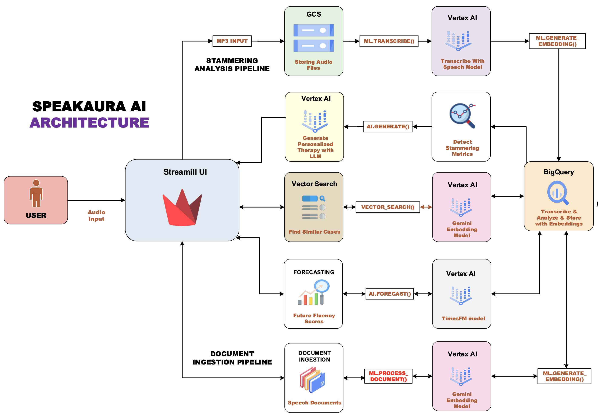

# Speak Aura AI

## Deployed link : https://speakaura-389325321804.us-central1.run.app/


A speech analysis tool that identifies and analyzes stammering patterns using **Google Cloud BigQuery AI**.  
Our solution empowers individuals with speech disfluencies to **track progress, receive personalized therapy plans, and compare their journey with similar cases** — all powered by **SQL + AI**.

---

## 🚀 Overview

- 🎤 Upload speech audio → stored in **Google Cloud Storage**  
- 📝 Transcribe + analyze → processed in **BigQuery AI**  using ML.transcribe
- 📊 Detect stammering metrics (pauses, repetitions, fillers)  
- 🧠 Generate personalized therapy guidance with **Gemini**  using AI.GENERATE
- 🔍 Find similar cases using **vector search** embeddings  using ML.GENERATE_EMBEDDING AND VECTOR_SEARCH
- 🔮 Forecast future fluency scores with **AI.FORECAST**  using AI.FORECAST (This creates a **feedback loop** where users can **monitor, compare, and improve** their speech patterns over time.)  

---

## 🏗️ Architecture





## How Our Solution Uses BigQuery AI

### 🖼️ Multimodal Pioneer
- Built a **BigQuery Object Table** referencing audio files stored in GCS.  
- This allows us to **treat raw audio as queryable data in SQL**, bridging **unstructured (audio)** with **structured (transcripts + metrics)** seamlessly.  

### 🕵️ Semantic Detective
- Generated **embeddings** with **`ML.GENERATE_EMBEDDING`** and performed **`VECTOR_SEARCH`** in BigQuery.  
- This enables our app to **find similar past speech cases**, so users can compare their journey with others and learn from proven strategies.  

### 🧠 AI Architect
- Applied **`AI.FORECAST`** to predict **future fluency scores**, giving users a forward-looking view of their speech progress.  
- Used **`AI.GENERATE (Gemini)`** to create **personalized therapy plans** based on transcript + stammering metrics.  

---
✅ By combining **forecasting, semantic search, and multimodal analysis**, our solution demonstrates the **full spectrum of BigQuery AI capabilities** in one integrated workflow.  


## Local Setup & Execution

### Tested with python version 3.11.7

We provide a step-by-step guide to set up and run **SpeakAura AI** locally. To get started:

1. Configure a billing-enabled Google Cloud project in your `.env` file.
2. Run the setup script — it will automatically handle IAM permissions and create the necessary resources.
3. Once complete, the system is ready to use.

This makes it easy to get the project running locally without manual resource setup.


## Project Setup

## 1. Set up Google Cloud Project credentials

1. Make sure you have a **Google Cloud Project**.  
2. Create **service account** and download a **key** with the required permissions in IAM in GCP.  
   make sure you are in root folder
   ```
   mkdir credentials

   ```
3. put the **service account key json** under the **credentials folder** (please create) and use that path in required env variable

## 2. Create a .env file

1. Copy from `.env-template` → `.env` 
2. Fill in required values (project, dataset, bucket, etc).
3. Make source you filled the 

```
PROJECT_ID , 
PROJECT_NUMBER and 
MAIN_ACCOUNT_ID ,
SERVICE_ACCOUNT_KEY_ID,
SERVICE_ACCOUNT_KEY_FILE_PATH.
```

## 3. Create a virtual environment

``` bash

Tested with python version 3.11.7

python3 -m venv aura_env
source aura_env/bin/activate 
# On Windows: venv aura_env\Scripts\activate

```
## 4. Install dependencies

``` bash
pip install -r requirements.txt

```

## 5. Set up GCP resources and permissions

1. Open the notebook under notebooks folder and choose create env 

``` bash

notebooks/gcp_resource_setup.ipynb

```
2. Run all cells to configure IAM roles + connections.

## 6. Create project resources

1. Open a terminal and navigate to the root folder:
2. Run the resource creation script:
``` bash

python create_resource.py

```

## 7. Run the project

1. Open a new terminal.
2. Make sure you are in the root folder of the project.
3. Launch the Streamlit app

``` bash
streamlit run streamlit_app.py
```

## Project Structure

```
speak-aura-ai/
│── assets/                          # images
│── credentials/                     # 🔐 Service account keys (not checked into Git)
│
├── data/                            # 📂 Sample datasets
│   ├── audio/                       # Example input audio files for testing
│   ├── courses/                     # Example input course files for testing
│   ├── docs/                        # Example input pdf files for testing
│   └── transcripts/                 # Example transcripts for practice/recording
├── notebooks/                       # 📓 Jupyter notebooks for setup/experiments
│   └── gcp_resource_setup.ipynb     # Notebook to configure IAM + GCP resources
│
├── src/                             # 🧩 Core backend source code
│   └── bigquery_utils/              # Helper modules for BigQuery operations
│   │    ├── embeddings.py           # Text embeddings + similarity search
│   │    ├── forecasting.py          # Fluency improvement forecasting (time-series ML)
│   │    ├── pdf_processing.py       # PDF ingestion + text extraction
│   │    ├── retrieval.py            # Semantic retrieval of therapy content
│   │    ├── therapy.py              # Therapy plan generation logic
│   │    └── transcription.py        # Speech-to-text transcription helpers
│   ├── analyze_stammer.py           # Runs stammering detection on transcripts
│   ├── client.py                    # GCP client initialization (BQ, GCS, etc.)
│   ├── config.py                    # Central configs: project IDs, bucket names
│   ├── pipeline.py                  # Orchestrates pipeline (upload → analysis → output)
│   └── upload_to_gcs.py             # Upload audio/transcripts into GCS
│
├── streamlit_utils/                 # 🎨 Streamlit UI components
│   ├── load_side_bar.py             # Sidebar UI (upload controls, navigation)
│   ├── streamlit_helpers.py         # Shared UI helpers/utilities
│   ├── tab_about.py                 # "About" section
│   ├── tab_analysis.py              # Stammer analysis tab (metrics + results)
│   ├── tab_chat.py                  # AI Therapy Chat interface
│   ├── tab_courses.py               # Recommended courses & gamified exercises
│   ├── tab_ingest_document.py       # Document ingestion tab (knowledge base)
│   ├── tab_progress.py              # Progress dashboard (trends & forecasts)
│   ├── tab_semantic.py              # Semantic search (find similar cases/resources)
│   └── tab_upload.py                # Upload audio tab
│
├── tests/                           # 🧪 Unit & integration tests
│   └── test_transcribe.py           # Tests for transcription pipeline
│
│── .env                             # Local environment variables (not tracked in Git)
│── .env-template.txt                # Template for .env file (safe to share)
│── .gitignore                       # Git ignore rules
│── README.md                        # 📘 Project documentation
│── requirements.txt                 # Python dependencies
│── create_resource.py               # Script to set up GCS & BigQuery resources
└── streamlit_app.py                 # 🚀 Main Streamlit entrypoint

```

## Deployment on GCP using Cloud Run

1. Run this commands from root of the project 

```
gcloud services enable run.googleapis.com artifactregistry.googleapis.com cloudbuild.googleapis.com

```

```
gcloud builds submit --tag gcr.io/[PROJECT_ID]/[docker-image-name]

```

```
gcloud run deploy [app-name] \
  --image gcr.io/[PROJECT_ID]/[docker-image-name] \
  --platform managed \
  --region us-central1 \
  --allow-unauthenticated

```

## Feedback on BigQuery AI 🚀

We really enjoyed building with BigQuery AI and want to share some feedback from our experience:

- **Strengths we loved:**
  - Seamless SQL-first integration of AI (e.g., `ML.GENERATE_TEXT`, `AI.FORECAST`, `VECTOR_SEARCH`) made it very intuitive.
  - Ability to work directly inside BigQuery without exporting data reduced complexity.
  - Multimodal + vector search capabilities gave us flexibility to handle unstructured data like PDFs and audio.

- **Challenges we faced:**
  - I have **created 3 accounts** during this hackathon because some accounts got disabled unexpectedly. This caused delays and   made it harder to stay focused on implementation.
  - Billing/project setup took more time than expected compared to actual model development.

- **Suggestions for improvement:**
  - Providing a **sandbox environment for hackathon participants** would save time and allow teams to focus on innovation instead of account setup.
  - Clearer troubleshooting guides around account restrictions and IAM permissions would be helpful.
  - Easier local testing / simulation tools for `AI.GENERATE` and `VECTOR_SEARCH` before deploying on full datasets would be great.

Overall, BigQuery AI felt like a **powerful extension of SQL**, and once setup hurdles were cleared, development was smooth and productive. We believe lowering the entry barrier with a sandbox would make the hackathon experience even better.


## Reference Used for Coding

https://cloud.google.com/bigquery/docs/bqml-introduction

https://github.com/GoogleCloudPlatform/generative-ai/tree/main/gemini/use-cases/applying-llms-to-data

https://github.com/GoogleCloudPlatform/generative-ai/tree/main/gemini/use-cases/retrieval-augmented-generation
